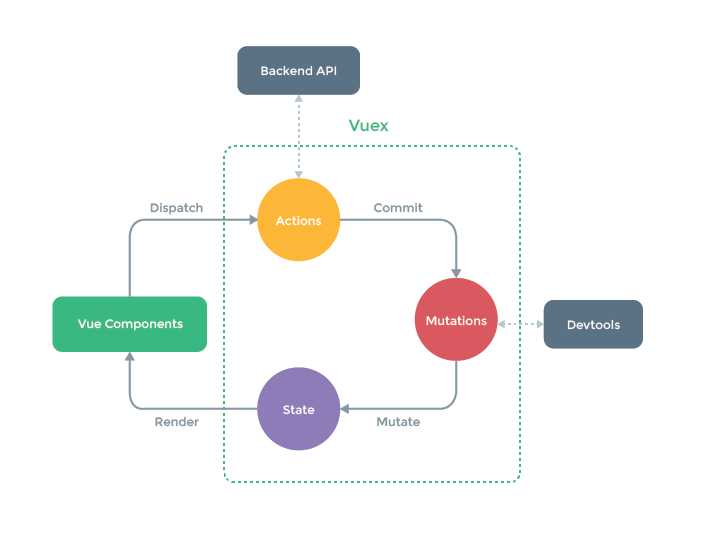

# Что такое Vuex?

Vuex - **паттерн управления состоянием + библиотека** для приложений на Vue.js. Он служит централизованным хранилищем данных для всех используемых в приложении компонентов, при помощи определённых правил обеспечивая предсказуемость изменений данных. Кроме того, Vuex интегрируется с официальным [расширением инструментов разработчика](https://github.com/vuejs/vue-devtools) Vue, предоставляя "из коробки" такие продвинутые возможности как "путешествия во времени" при отладке и экспорт/импорт слепков состояния данных.

### Что такое "Паттерн Управления Состоянием"?

Давайте начнём с простого приложения, реализующего счётчик с использованием Vue:

``` js
new Vue({
  // состояние
  data () {
    return {
      count: 0
    }
  },
  // представление
  template: `
    <div>{{ count }}</div>
  `,
  // действия
  methods: {
    increment () {
      this.count++
    }
  }
})
```

Это самостоятельное приложение состоит из следующих частей:

- **Состояние**, являющееся "источником истины", управляющим приложением;
- **Представление**, представляющее из себя всего лишь декларативное отображение **состояния**;
- **Действия**, определяющие возможные пути изменения состояния приложения в ответ на взаимодействие пользователя с **представлением**.

Вот простейшее представление концепции "однонаправленного потока данных":

<p style="text-align: center; margin: 2em">
  
</p>

Но простота быстро теряется при появлении **нескольких компонентов, основывающихся на одном и том же состоянии**:

- Несколько представлений могут зависеть от одной и той же части состояния приложения
- Действия из разных представлений могут оказывать влияние на одни и те же части состояния приложения

В рамках первой проблемы, передача входных параметров в глубоко вложенные компоненты может быть утомительной, а для соседних компонентов и вовсе не сработает. Решая вторую проблему, мы нередко обнаруживаем себя прибегающими к таким средствам как обращение к прямым родителям/потомкам компонента, или в попытках внести изменения и затем синхронизировать эти изменения с другими местами в приложении, используя события. Оба подхода хрупки и быстро приводят к появлению кода, который невозможно поддерживать.

Так почему бы не вынести всё общее состояние из компонентов, управляя им в глобальном синглтоне? При использовании этого подхода, дерево компонентов станет одним большим "представлением", а каждый компонент получит доступ к состоянию приложения и возможности вызывать действия по его обновлению, независимо от расположения компонента в дереве.

Кроме того, определяя и разделяя концепции, возникающиее при управлении состоянием и требуя соблюдения некоторых правил, мы улучшаем структурированность и поддерживаемость нашего кода.

Такова основная идея, лежащая в основе Vuex, вдохновлённого [Flux](https://facebook.github.io/flux/docs/overview.html), [Redux](http://redux.js.org/) и [Архитектурой Elm](https://guide.elm-lang.org/architecture/). В отличии от других паттернов, Vuex представляет собой также и реализацию в виде библиотеки, специально заточенной на использование совместно с Vue.js и позволяющей получить преимущество из-за использования его систем реактивности и эффективных обновлений.



### В Каких Случаях Следует Использовать Vuex?

Хотя Vuex и помогает управлять совместно используемым состоянием, ценой этого является привнесение новых концепций и вспомогательного кода. Имеет место быть сделка между кратковременной и долгосрочной продуктивностью.

Если вам ещё не доводилось создавать крупномасштабный одностраничные приложения, Vuex может показаться многословным и обескураживающим. Это норма — простые приложения вполне могут обойтись и без Vuex. Возможно, вполне достаточно будет использования и простой [глобальной шины событий](http://vuejs.org/guide/components.html#Non-Parent-Child-Communication). Но если вы создаёте SPA среднего или крупного размера, вероятно вам уже приходилось сталкиваться с ситуациями, заставляющими задуматься о методах более эффективного управления состоянием приложения за пределами компонентов Vue, и Vuex в таком случае окажется естественным следующим шагом. Есть неплохая цитата от Дэна Абрамова, автора Redux:

> Flux-библиотеки подобны очкам: если они вам действительно нужны, вы на этот счёт не сомневаетесь.